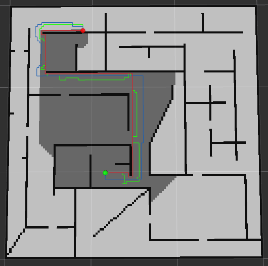
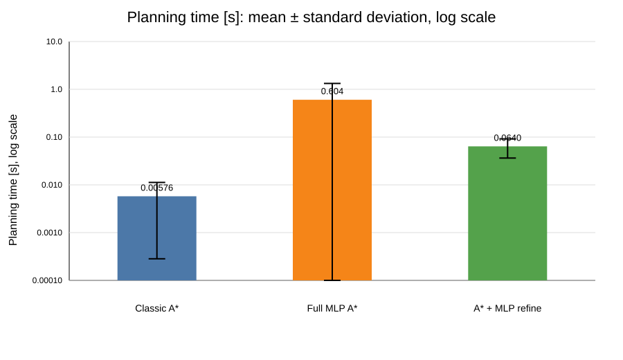
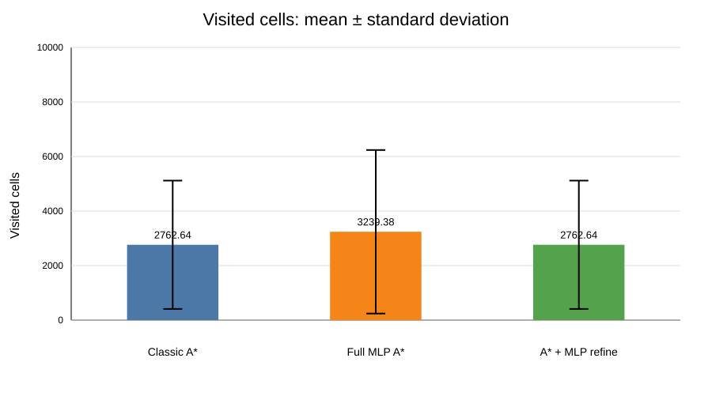
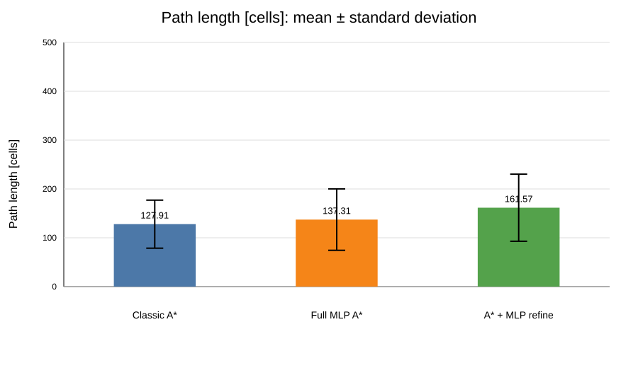

# MLP A* Planner

## Temat projektu

Tematem projektu jest wykorzystanie prostej sieci neuronowej MLP jako zamiennika klasycznej mapy zajętości 2D w planerze A*. Sieć neuronowa uczy się rozpoznawać, czy dany punkt mapy znajduje się w obszarze wolnym, czy zajętym, a następnie jest używana podczas planowania ścieżki.

Dodatkowo w projekcie wykorzystano gradient wyjścia sieci względem wejścia. Gradient pozwala określić, czy punkt znajduje się blisko granicy przeszkody. Dzięki temu planner może wybierać trasę z większym zapasem od ścian.

---

## Cel projektu

Celem projektu było sprawdzenie, czy klasyczna mapa zajętości może zostać częściowo zastąpiona przez wytrenowaną sieć MLP oraz czy informacja gradientowa z tej sieci może poprawić kształt ścieżki generowanej przez A*.

W projekcie wykonano:

- przygotowanie mapy zajętości 2D,
- spróbkowanie mapy i utworzenie datasetu,
- wytrenowanie prostej sieci MLP w PyTorch,
- użycie MLP jako modelu zajętości przestrzeni,
- obliczanie gradientu sieci w punkcie,
- integrację gradientu z funkcją kosztu A*,
- porównanie klasycznego A*, pełnego MLP A* oraz wariantu z korekcją ścieżki,
- wizualizację ścieżek i odwiedzonych komórek w RViz.

---

## Metoda realizacji

Mapa zajętości została spróbkowana w celu utworzenia datasetu uczącego. Wejściem do sieci są współrzędne punktu:

```text
x, y
```

Wyjściem jest informacja o zajętości punktu:

```text
0 - obszar wolny
1 - obszar zajęty
```

W testach wykorzystano stworzoną ręcznie mapę `map_large.pgm` o rozmiarze:

$$
120 \times 120 = 14400
$$

czyli łącznie `14400` komórek mapy.

Sieć MLP została wytrenowana tak, aby na podstawie współrzędnych punktu przewidywać, czy punkt znajduje się w wolnej przestrzeni, czy w przeszkodzie. W ten sposób MLP może pełnić rolę przybliżonej, ciągłej reprezentacji mapy zajętości.

Najważniejszym elementem projektu jest wykorzystanie gradientu sieci MLP. Model można traktować jako funkcję:

$$
f(x, y) \rightarrow [0, 1]
$$

gdzie wartość bliska `0` oznacza obszar wolny, a wartość bliska `1` oznacza obszar zajęty.

Dla każdego analizowanego punktu obliczany jest gradient wyjścia sieci względem współrzędnych wejściowych:

$$
\nabla f(x, y) =
\left[
\frac{\partial f}{\partial x},
\frac{\partial f}{\partial y}
\right]
$$

Następnie wyznaczana jest norma gradientu:

$$
\left\| \nabla f(x, y) \right\|_2 =
\sqrt{
\left(\frac{\partial f}{\partial x}\right)^2 +
\left(\frac{\partial f}{\partial y}\right)^2
}
$$

W miejscach oddalonych od granic przeszkód wartość funkcji MLP zmienia się wolno, dlatego norma gradientu jest mała. W pobliżu granicy pomiędzy obszarem wolnym i zajętym wartość sieci zmienia się szybciej, dlatego norma gradientu rośnie.

Informacja ta została dodana do kosztu przejścia w algorytmie A*. Kara gradientowa ma postać:

$$
P_{grad}(x, y) =
\lambda_{grad} \cdot
\left\| \nabla f(x, y) \right\|_2
$$

Całkowity koszt dojścia do kolejnego punktu jest liczony jako:


$$
g_{new}(n) = g(current) + c(current, n) + P_{grad}(n)
$$

gdzie:

- $g_{current}$ — dotychczasowy koszt dojścia do aktualnego punktu,
- $c_{move}$ — koszt wykonania ruchu do sąsiedniej komórki,
- $P_{grad}(x, y)$ — dodatkowa kara za znajdowanie się blisko granicy przeszkody,
- $\lambda_{grad}$ — współczynnik określający wpływ gradientu na koszt planowania.

Dzięki temu punkty znajdujące się blisko ścian mają większy koszt. Planner wybiera więc trasę, która nie tylko prowadzi do celu, ale również zachowuje większy odstęp od przeszkód.

We wszystkich wariantach algorytmu A* zastosowano heurystykę Manhattana:

$$
h(x, y) =
|x_{goal} - x| + |y_{goal} - y|
$$

Funkcja oceny w A* ma standardową postać:

$$
F(x, y) = g(x, y) + h(x, y)
$$

W wariancie klasycznym koszt $g(x, y)$ zależy głównie od długości przejścia. W wariancie MLP koszt $g(x, y)$ jest dodatkowo zwiększany przez karę gradientową, co powoduje odsuwanie planowanej ścieżki od przeszkód.

Porównano trzy warianty:

- `Classic A*` — klasyczny A* korzystający bezpośrednio z mapy zajętości,
- `Full MLP A*` — A*, w którym sprawdzanie zajętości oraz kara gradientowa opierają się na modelu MLP,
- `A* + MLP refine` — klasyczny A* wyznacza ścieżkę bazową, a następnie ścieżka jest odsuwana od przeszkód z użyciem informacji z MLP.

---

## Struktura projektu

```text
MiAPR-project/
├── data/
├── launch/
├── maps/
├── mlp_astar_planner/
├── resource/
├── results/
├── rviz/
├── test/
├── package.xml
├── setup.py
└── README.md
```

Najważniejsze katalogi:

- `data/` — dataset oraz zapisany model MLP,
- `maps/` — mapy zajętości 2D,
- `mlp_astar_planner/` — kod planera, modelu MLP, treningu i generowania danych,
- `launch/` — pliki startowe ROS 2,
- `rviz/` — konfiguracje RViz do wizualizacji,
- `results/` — wykresy wyników po testach porównawczych.

Najważniejsze pliki w katalogu `mlp_astar_planner/`:

- `astar_classic.py` — klasyczny algorytm A*,
- `astar_mlp.py` — wariant A* wykorzystujący MLP i gradient,
- `grid_map.py` — obsługa mapy zajętości,
- `dataset_generator.py` — generowanie datasetu przez próbkowanie mapy,
- `train_mlp.py` — trening sieci MLP,
- `mlp_model.py` — definicja modelu MLP,
- `points.py` — generowanie punktu startowego i końcowego.

---
## Przykładowy wynik działania programu

Poniżej przedstawiono przykładowy wynik działania programu w RViz. Wizualizacja pokazuje porównanie ścieżek wyznaczonych przez trzy warianty planera oraz komórki odwiedzone przez klasyczny algorytm A*.



Na rysunku oznaczono:

- czerwona ścieżka — wynik działania klasycznego algorytmu `A*`,
- niebieska ścieżka — wynik działania wariantu `Full MLP A*`,
- zielona ścieżka — wynik działania wariantu hybrydowego `A* + MLP refine`,
- zielony punkt — punkt startowy,
- czerwony punkt — punkt docelowy,
- ciemnoszare komórki — komórki odwiedzone przez klasyczny algorytm `A*`.

Widać, że klasyczny `A*` wybiera krótszą trasę, która może przebiegać bliżej przeszkód. Wariant `Full MLP A*` wykorzystuje gradient modelu MLP, dlatego ścieżka jest prowadzona z większym zapasem od ścian. Wariant hybrydowy koryguje ścieżkę bazową, odsuwając ją od przeszkód po wyznaczeniu trasy przez klasyczny algorytm.

## Wyniki po 100 uruchomieniach programu

Do porównania algorytmów wykorzystano specjalny skrypt testowy, który wykonał 100 uruchomień programu dla badanych wariantów planera. W każdym uruchomieniu zapisano metryki opisujące działanie algorytmu: czas planowania, liczbę odwiedzonych komórek oraz długość otrzymanej ścieżki w komórkach mapy.

Na podstawie zebranych danych obliczono statystyki metryk, a następnie wygenerowano wykresy średnich wartości oraz odchyleń standardowych. Wykres czasu planowania ścieżki przedstawiono w skali logarytmicznej, aby czytelnie pokazać różnice pomiędzy klasycznym A* i wariantami wykorzystującymi MLP.

Porównane warianty:

- `Classic A*`,
- `Full MLP A*`,
- `A* + MLP refine`.

---

## Czas planowania



| Planner | Średni czas planowania [s] |
|---|---:|
| Classic A* | 0.00576 |
| Full MLP A* | 0.604 |
| A* + MLP refine | 0.0640 |

Klasyczny A* uzyskał najkrótszy czas planowania.  
`Full MLP A*` był najwolniejszy, ponieważ podczas działania wykonuje inferencję sieci oraz wykorzystuje informację gradientową.  
`A* + MLP refine` działa znacznie szybciej niż pełny wariant MLP, ponieważ najpierw korzysta z klasycznego A*, a dopiero później wykonuje korekcję ścieżki.

---

## Liczba odwiedzonych komórek



| Planner | Średnia liczba odwiedzonych komórek |
|---|---:|
| Classic A* | 2762.64 |
| Full MLP A* | 3239.38 |
| A* + MLP refine | 2762.64 |

`Classic A*` oraz `A* + MLP refine` odwiedziły średnio taką samą liczbę komórek, ponieważ wariant z korekcją ścieżki bazuje na wyniku klasycznego A*.  
`Full MLP A*` odwiedził więcej komórek, ponieważ uwzględnia dodatkowy koszt związany z gradientem i szuka ścieżki z większym zapasem od przeszkód.

---

## Długość ścieżki



| Planner | Średnia długość ścieżki [komórki] |
|---|---:|
| Classic A* | 127.91 |
| Full MLP A* | 137.31 |
| A* + MLP refine | 161.57 |

Najkrótszą średnią ścieżkę uzyskał klasyczny A*.  
`Full MLP A*` generuje nieco dłuższą ścieżkę, ponieważ unika przechodzenia blisko przeszkód.  
`A* + MLP refine` uzyskał najdłuższą średnią ścieżkę, ponieważ korekcja odsuwa punkty ścieżki od ścian, przez co trasa oddala się od optymalnego przebiegu wyznaczonego przez klasyczny A*.

---

## Wnioski

Klasyczny A* jest najszybszym wariantem i generuje najkrótszą ścieżkę, ale jego ścieżka może przebiegać blisko przeszkód, ponieważ algorytm optymalizuje głównie koszt dojścia do celu.

`Full MLP A*` dobrze znajduje ścieżkę i lepiej utrzymuje odległość od ścian, ponieważ zamiast klasycznej mapy zajętości wykorzystuje wytrenowany model MLP. Gradient modelu jest uwzględniany w funkcji kosztu, więc komórki znajdujące się blisko granic przeszkód otrzymują większy koszt. Dzięki temu planner wybiera bezpieczniejszą trasę z większym zapasem. Wadą tego wariantu jest znacznie większy czas obliczeń.

`A* + MLP refine` działa średnio około 100 razy szybciej niż `Full MLP A*`, ponieważ nie wykonuje pełnego wyszukiwania z MLP. Najpierw korzysta z klasycznego A*, a dopiero później przesuwa ścieżkę na podstawie informacji gradientowej. Wadą tego podejścia jest większa długość ścieżki, ponieważ poprawa polega na odsuwaniu gotowej trasy od przeszkód, a nie na pełnym ponownym planowaniu.

Wariant z korekcją ścieżki zależy od oryginalnej ścieżki wyznaczonej przez klasyczny A*. Przy zmianie otoczenia może to powodować niepotrzebne pętle lub mniej naturalny kształt ścieżki. Testowana była również wersja uwzględniająca historię zmodyfikowanej ścieżki, ale przez jeszcze większe oddalenie od optymalnego toru wybierała ona dłuższe trasy. Z tego powodu ten wariant nie został wybrany jako finalny.

Ostatecznie projekt pokazuje, że MLP może zostać użyte jako przybliżona reprezentacja mapy zajętości, a gradient sieci może skutecznie wpływać na planowanie bezpieczniejszej ścieżki oddalonej od przeszkód.

---

## Instrukcja uruchomienia

### 1. Przejście do przestrzeni roboczej ROS 2

```bash
cd ~/ros2_ws
```

### 2. Sklonowanie repozytorium

```bash
cd src
git clone https://github.com/krukich/MiAPR-project.git mlp_astar_planner
cd ..
```

### 3. Instalacja wymagań

Należy upewnić się, że zainstalowany jest PyTorch:

```bash
pip install torch
```

### 4. Zbudowanie przestrzeni roboczej

```bash
colcon build --symlink-install
```

### 5. Załadowanie środowiska

```bash
source install/setup.bash
```

### 6. Uruchomienie projektu

```bash
ros2 launch mlp_astar_planner astar_comparision.launch.py
```